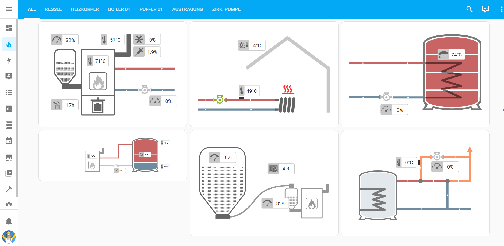
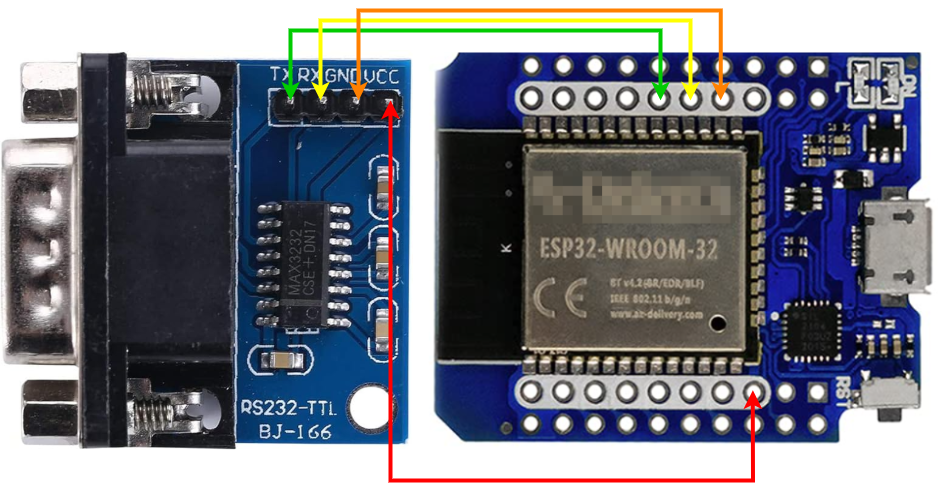

# ESPHome-Froeling-Lambdatronic_3200

### ESHome RS232 to TTL - ESP32 - Read data from Froeling / Lambdatronic 3200

I'm testing this with my Fröling SP Dual. But I assume it should also work for other models that have the Lambdatronic 3200 control unit. Feedback appreciated.

#### Parts:
Wemos D1 Mini ESP32:
https://www.amazon.de/dp/product/B08BTRQNB3

MAX3232 DB9 RS232 TTL converter:
https://www.amazon.de/gp/product/B0BNQ41QKQ

|  Wemos | TX  | RX  | 5V  | G  |
|---|---|---|---|---|
| MAX3232  | RX  |  TX |  VCC | GND  |

Connect a RS232 (DB9) cable between "MAX3232 DB9 RS232 TTL converter" and you boiler's mainboard (COM2).

#### Boiler Settings:
- Click on the user icon
- Enter code "-7"
- Boiler > Modbus Protokoll RTU(1)
- Boiler > use Modbus Protokoll 2014

#### Home Assistant Dashboard
##### prerequisites:
- https://experiencelovelace.github.io/ha-floorplan/
- copy all files from /ha_dashboard/* to your Home assistant instance /config/www/froeling/*
- create a card in your dashboard and add the content of "ha_dashboard.yaml"
!! Currently, only two panels are provided!! I'm working on the rest. An update will follow.

#### ESPHome
For an better overview I've splittet up the yaml file into multiple pieces and included them in the main file as a package.

Copy all files from ESPHome/* into you ESPHome config directory and just flash the froeling.yaml. - All other files will be included.