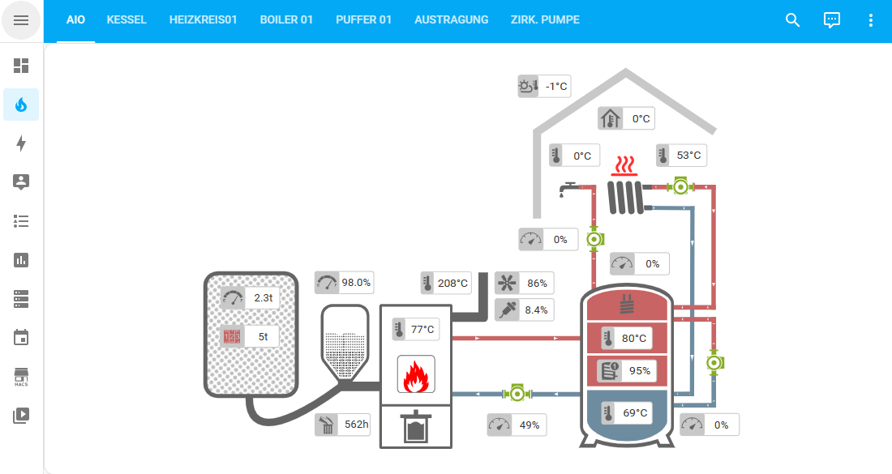
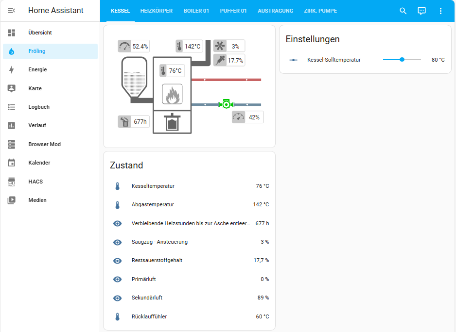
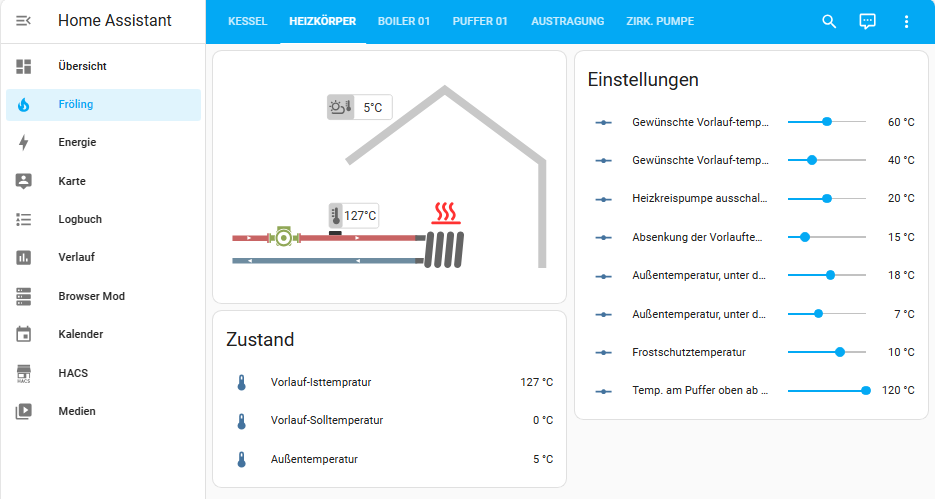
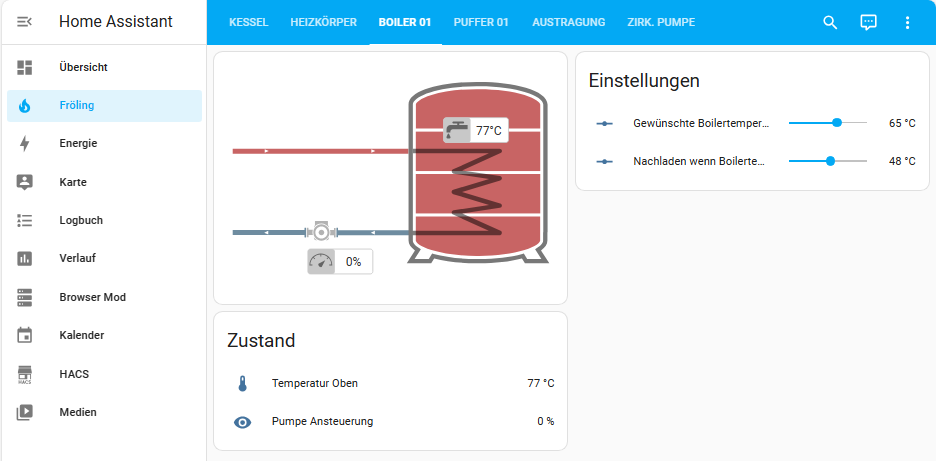
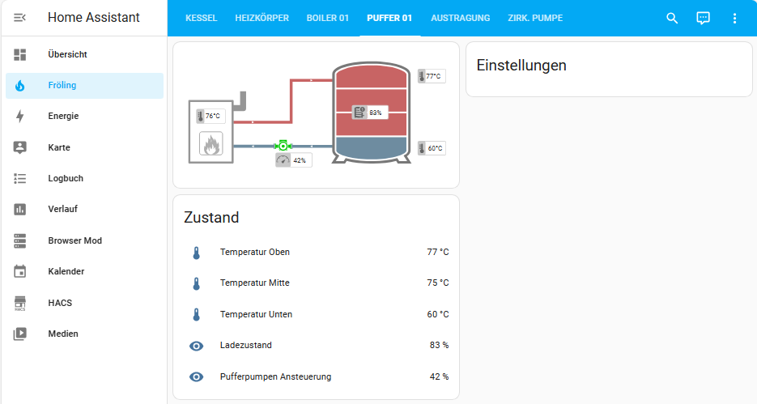
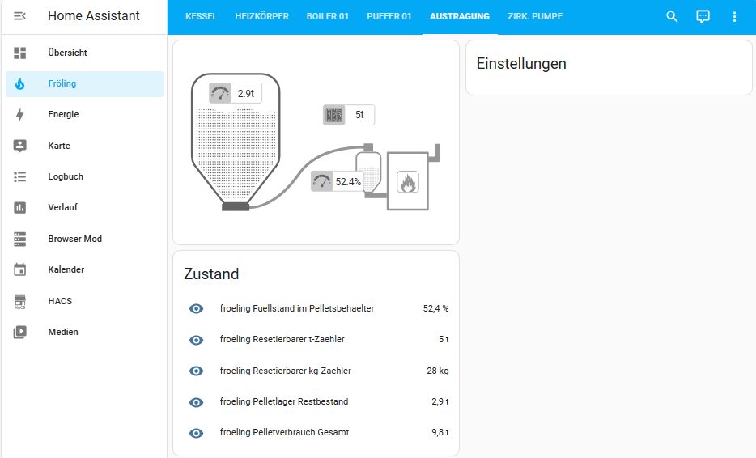
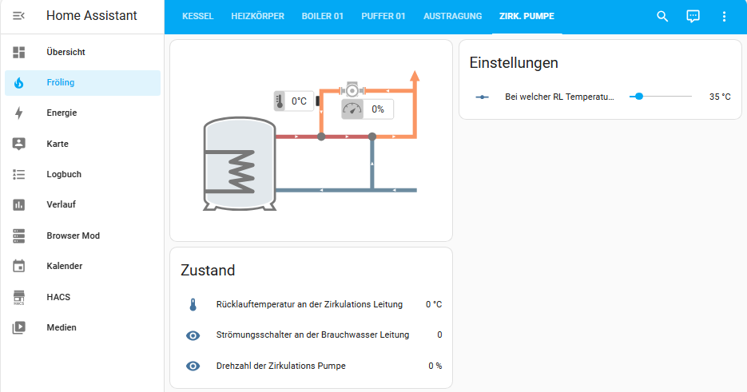
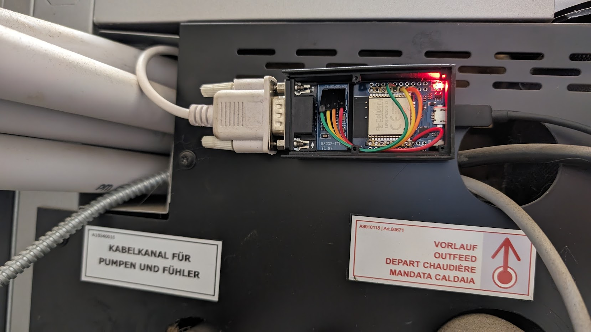
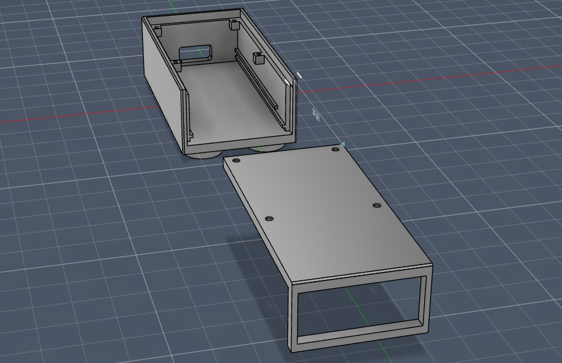
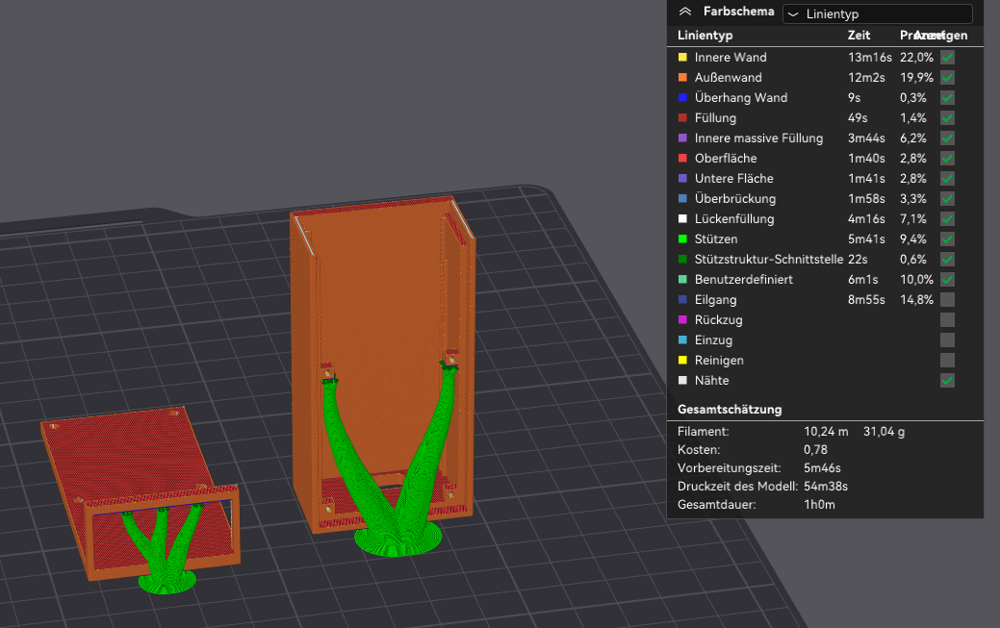

# ESPHome-Froeling-Lambdatronic_3200









## ESHome RS232 to TTL - ESP32 - Read data from Froeling / Lambdatronic 3200

I'm testing this with my Fröling SP Dual 20 (V 50.04 B 05.19). But I assume it could also work for other models that have the Lambdatronic 3200 control unit. Feedback appreciated.
I requested and received from Fröling support the ModBus communication protocol for V 50.04 B 05.19 (see pdf file).

### Parts
  
Wemos D1 Mini ESP32:
<https://www.amazon.de/dp/product/B08BTRQNB3>

MAX3232 DB9 RS232 TTL converter:
<https://www.amazon.de/gp/product/B0BNQ41QKQ>


  
|  Wemos | TX  | RX  | 5V  | G  |
|---|---|---|---|---|
| MAX3232  | RX  |  TX |  VCC | GND  |

Connect an RS232 (DB9) cable between the "MAX3232 DB9 RS232 TTL converter" and your boiler's mainboard (COM2).

### Boiler Settings

- Click on the user icon
- Enter code "-7"
- Settings > General Settings > MODBUS Settings > Modbus Protokoll RTU (1)
- Settings > General Settings > MODBUS Settings > use Modbus Protokoll 2014 -> yes
- Settings > General Settings > MODBUS Settings > Use COM2 as MODBUS Interface -> yes

### Home Assistant Dashboard

- required: <https://experiencelovelace.github.io/ha-floorplan/>
- copy all files from /ha_dashboard/ *to your Home Assistant instance /config/www/froeling/*
- create a new Dashboard and add the content of "ha_dashboard.yaml"
- The SVG files contain image and text objects (IDs) which have to match the entity name. Therefore I recommend not changing the device name of your ESP32.
- As the setup of the heating unit can vary a lot for everyone just remove the panels that won't fit your needs.

### ESPHome

I divided the yaml file into several sections and added them to the main file as a remote package to provide a better overview.  
Just flash the "froeling.yaml" to your ESP32. (Edit API, OTA & WiFi according to your device/environment)

As the setup of the heating unit can vary a lot for everyone remove the reference to the *.yaml files for the components you don't need before flashing.

```
packages:
  remote_package:
    url: https://github.com/GyroGearl00se/ESPHome-Froeling-Lambdatronic_3200
    ref: main
    files: [
      austragung.yaml,
      boiler_01.yaml,
      heizkreis01.yaml,
      heizkreis02.yaml,
      kessel.yaml,
      puffer_01.yaml,
      zirkulationspumpe.yaml,
      solarthermie.yaml,
      ]

```

### 3D Printed case

I've designed a housing for a Wemos ESP32 & RS232 Adapter. The front section is a bit fragile - But other than that. It works quite well. At the bottom, you'll find round inlays where you could fit in some 3x10mm magnets to attach the case easily to the housing of your heating unit.


(Picture without lid to give you a better idea)





### Contribution
  
Wrong/Missing data? Feel free to create an issue or fork this repository and create a pull request with your fix.
